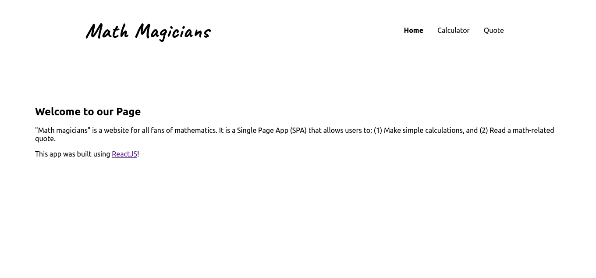
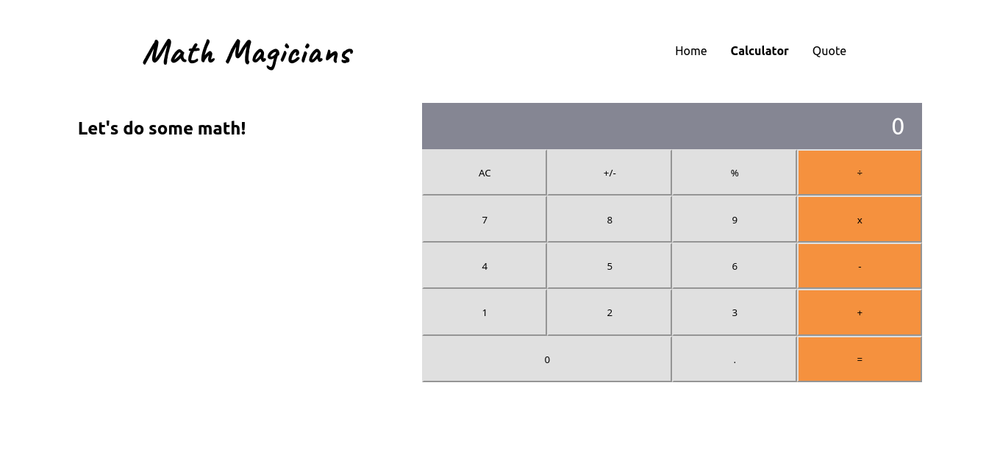
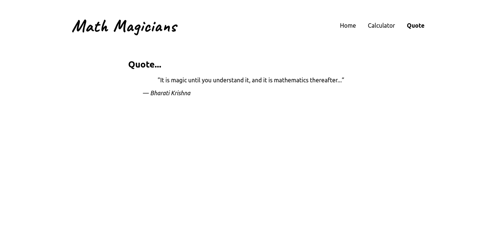

<p align="center">
  <a href="https://www.microverse.org/">
    
  </a>
  <a href="https://github.com/enionsouza/math-magicians">
    
  </a>
  <a href="https://github.com/enionsouza/math-magicians">
    
  </a>
</p>


# Math Magicians

## About

"Math magicians" is a website whose core functionality is a calculator.

Below, a screenshot of each page of the app is presented.

<p align="center">
    
</p>
<p align="center">
    
</p>
<p align="center">
    
</p>

## Built With

- HTML, CSS, JavaScript;
- ReactJS;
- VisualStudio Code, Git, & GitHub;

## Pre-requisites

- NodeJs (v. 14.17)
- YarnJs (v. 1.22.10)
- Git

## Live Demo

A live demo for this project can be found in [this link](https://enionsouza.github.io/math-magicians/).

## Getting Started

To run this project, you only need a computer with a browser installed, and follow these steps:


1. In your terminal, in the folder of your preference, type the following bash command to clone this repository:

```sh
git clone git@github.com:enionsouza/math-magicians.git
```

2. Now that you have already cloned the repo run the following commands to get the project up and running:
```sh
cd math-magicians
yarn
yarn start
```


## Author

👤 **Ênio Neves de Souza**

- GitHub: [@enionsouza](https://github.com/enionsouza)
- Twitter: [@enionsouza](https://twitter.com/enionsouza)
- LinkedIn: [Enio Neves de Souza](https://www.linkedin.com/in/enio-neves-de-souza/)

## 🤝 Contributing

Contributions, issues, and feature requests are welcome!

Feel free to check the [issues page](https://github.com/enionsouza/math-magicians/issues).

## Show your support

Give a ⭐️ if you like this project!

## 📝 License

This project is [MIT](./LICENSE) licensed.